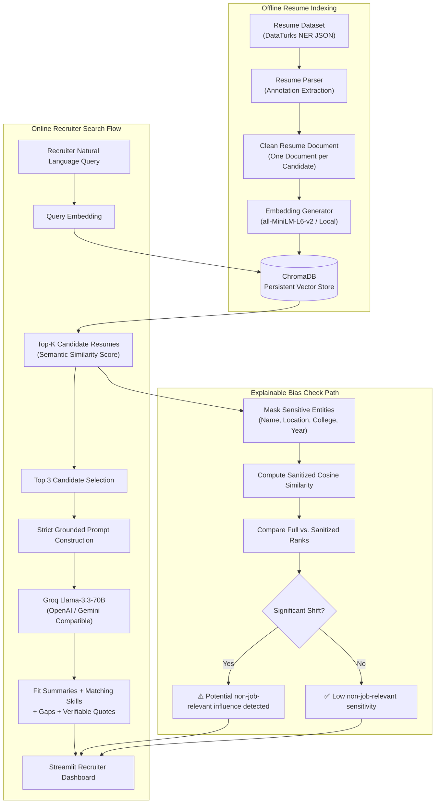

# 💼 RAG-Powered Talent Search Engine

[](https://www.python.org/)
[](https://www.langchain.com/)
[](https://www.trychroma.com/)
[](https://groq.com/)
[](https://streamlit.io/)
[](https://github.com/Abo0wael/RAG-Talent-Search)
[](https://opensource.org/licenses/MIT)

A production-grade **Retrieval-Augmented Generation (RAG)** pipeline and interactive recruiter search engine built for semantic candidate discovery. The system enables recruiters to express job requirements in natural language, semantically retrieves matching candidates from a persistent ChromaDB vector store, and leverages an LLM to generate evidence-backed, grounded fit evaluations.

---

## 📑 Table of Contents

- [Overview & Problem Statement](#overview--problem-statement)
- [System Architecture](#system-architecture)
- [Key Features](#key-features)
- [Dataset Setup & Security](#dataset-setup--security)
- [Technology Stack](#technology-stack)
- [Project Directory Structure](#project-directory-structure)
- [Installation & Quickstart](#installation--quickstart)
- [Building the Vector Database](#building-the-vector-database)
- [Running the Streamlit UI](#running-the-streamlit-ui)
- [Deployment Guide](#-deployment-guide)
- [Evaluation Methodology](#evaluation-methodology)
- [Explainable Bias Check](#explainable-bias-check)
- [Jupyter Notebooks](#jupyter-notebooks)
- [Limitations & Ethical Considerations](#limitations--ethical-considerations)
- [Author & Connect](#-author--connect)

---

## 🎯 Overview & Problem Statement

Traditional Applicant Tracking Systems (ATS) rely on brittle keyword matching. If a recruiter searches for *"Junior Data Analyst with SQL and Tableau"*, keyword-based tools often miss strong candidates who describe their skills using synonyms (e.g., *"relational database queries"*, *"data visualization"*, or *"business intelligence"*).

The **RAG Talent Search Engine** solves this by:
1. **Semantic Resume Discovery**: Uses local dense embeddings (`all-MiniLM-L6-v2`) to capture conceptual relevance beyond exact keyword matches.
2. **Whole-Candidate Retrieval**: Treats each resume as a complete, unified searchable document preserving context across education, roles, and technical proficiencies.
3. **Evidence-Grounded AI Explanations**: Passes Top-3 candidates to **Groq (`llama-3.3-70b-versatile`)** under strict prompting rules: **zero hallucinations**, mandatory resume quotes as evidence, and explicit `"Not specified"` designations for unverified claims.
4. **Interactive Candidate Q&A**: Recruiter chatbot interface to ask verification questions (e.g., *"Does this candidate have experience with cloud deployments?"*) grounded strictly in the resume.
5. **Explainable Bias Auditing**: Bonus fairness audit that flags whether retrieval rankings vary when non-job-relevant metadata (name, university, graduation year, location) is masked.

---

## 🏗️ System Architecture



---

## ✨ Key Features

### 1. Robust Resume Parsing
- Extracts entities from the DataTurks NER schema (`Skills`, `Designation`, `Companies worked at`, `Degree`, `College Name`, `Graduation Year`, `Years of Experience`, `Location`).
- Cleans URLs, redundant newlines, and artifacts while strictly retaining original content.
- Missing entities are designated as `None` or `"Not specified"` — **never fabricated**.

### 2. Local Dense Embeddings
- Built with `sentence-transformers/all-MiniLM-L6-v2` (384-dimensional dense vectors).
- Runs 100% locally on CPU without paid embedding API keys or external data transmission.

### 3. Persistent ChromaDB Vector Store
- Indexed with cosine distance metric (`hnsw:space: cosine`).
- Candidate documents are stored **as single complete documents** (no arbitrary chunking), ensuring that Top-K retrieval directly returns full candidate profiles.
- Automatic caching prevents re-embedding on app launch.

### 4. Grounded LLM Evaluation (Top 3 Candidates)
For each top candidate, the LLM outputs a structured evaluation:
- **Fit Summary**: Concise 1–2 sentence assessment against query requirements.
- **Matching Skills**: Verifiable technical skills explicitly listed in the resume.
- **Matching Experience**: Specific past roles, duties, or projects matching the query.
- **Relevant Education**: Degrees and universities documented in the candidate's profile.
- **Potential Gaps**: Identifiable missing requirements or ambiguities.
- **Evidence from Resume**: Exact quotes or bullet points cited directly from the resume text.

### 5. Multi-Provider LLM Support
Configurable via `.env`:
- **Groq** (Default: `llama-3.3-70b-versatile`) — Ultra-fast inference with frontier reasoning.
- **OpenAI** (`gpt-4o-mini`)
- **Google Gemini** (`gemini-1.5-flash`)

### 6. Recruiter Candidate Q&A
Dedicated interactive tab to ask targeted verification questions about specific candidates with answers strictly constrained to resume facts.

### 7. Explainable Bias Check
Audits whether candidate rankings diverge when non-job-relevant metadata (name, college, graduation year, location) is masked vs. full text. Outputs an informational audit signal with complete legal/fairness disclosures.

---

## 📂 Project Directory Structure

```
RAG-Talent-Search/
│
├── app.py                      # Streamlit Multi-Tab Application
├── requirements.txt            # Project Python dependencies
├── README.md                   # Comprehensive documentation
├── .gitignore                  # Git ignore rules (dataset, DB, env)
├── .env.example                # Environment variable template
├── .env                        # Local API keys (gitignored)
│
├── data/
│   ├── .gitkeep
│   └── Entity Recognition in Resumes.json   # (Manually placed, gitignored)
│
├── vectorstore/                # Persistent ChromaDB collection (gitignored)
│   └── .gitkeep
│
├── src/
│   ├── __init__.py             # Package init
│   ├── config.py               # Centralized configuration & settings
│   ├── data_loader.py          # DataTurks JSON reader & validator
│   ├── resume_parser.py        # NER annotation & text extraction
│   ├── embeddings.py           # Local Sentence-Transformers wrapper
│   ├── vector_store.py         # ChromaDB persistence & management
│   ├── retriever.py            # Cosine semantic retrieval & score normalizer
│   ├── prompts.py              # Zero-hallucination prompt templates
│   ├── llm.py                  # Multi-provider LLM factory (Groq/OpenAI/Gemini)
│   ├── rag_pipeline.py         # End-to-end RAG orchestrator & Q&A
│   ├── bias_checker.py         # Comparative bias & metadata audit
│   ├── evaluation.py           # Attribute-level precision/recall evaluation
│   └── utils.py                # Formatting, timing & cleaning helpers
│
├── scripts/
│   ├── build_index.py          # CLI vector store builder (--rebuild flag)
│   └── generate_notebooks.py   # Automated notebook creator
│
├── notebooks/
│   ├── 01_data_exploration.ipynb
│   ├── 02_resume_processing.ipynb
│   ├── 03_embeddings_and_vector_db.ipynb
│   ├── 04_semantic_search.ipynb
│   └── 05_rag_evaluation.ipynb
│
└── outputs/
    ├── figures/                # Saved charts and distribution plots
    └── evaluation/             # JSON evaluation benchmarks
```

---

## 🔒 Dataset Setup & Security

### Dataset Information
- **Source**: [Resume Entities for NER (Kaggle)](https://www.kaggle.com/datasets/dataturks/resume-entities-for-ner)
- **File Name**: `Entity Recognition in Resumes.json`
- **Volume**: 220 annotated resumes in DataTurks JSON-lines format.

### License & Security Policy
> [!IMPORTANT]
> The Kaggle dataset does not specify a permissive redistribution license. **The raw dataset is NEVER committed to GitHub**. It is strictly excluded in `.gitignore`.

### How to Download & Place the Dataset
1. Visit Kaggle: [Resume Entities for NER](https://www.kaggle.com/datasets/dataturks/resume-entities-for-ner).
2. Download `Entity Recognition in Resumes.json`.
3. Place the file inside the project `data/` folder:
   ```
   RAG-Talent-Search/data/Entity Recognition in Resumes.json
   ```
4. If the dataset is missing, the application displays a descriptive error message indicating the exact path required.

---

## ⚙️ Installation & Quickstart

### 1. Clone Repository & Setup Environment
```bash
git clone https://github.com/Abo0wael/RAG-Talent-Search.git
cd RAG-Talent-Search

# Create and activate virtual environment
python -m venv venv
# On Windows:
venv\Scripts\activate
# On Linux/macOS:
source venv/bin/activate
```

### 2. Install Dependencies
```bash
pip install -r requirements.txt
```

### 3. Configure Environment Variables
Copy `.env.example` to `.env`:
```bash
cp .env.example .env
```
Open `.env` and configure your API key (Groq is set as default):
```env
LLM_PROVIDER=groq
GROQ_API_KEY=gsk_your_groq_api_key_here
```
*(Optional: Set `OPENAI_API_KEY` or `GOOGLE_API_KEY` if testing alternative providers).*

---

## 🛠️ Building the Vector Database

Build the persistent ChromaDB collection using the provided indexing script:

```bash
# Build the index (only indexes if vectorstore is empty)
python scripts/build_index.py

# Force re-embedding and overwrite existing index
python scripts/build_index.py --rebuild
```

### Indexing Summary:
- **Resumes parsed**: 220 candidates
- **Embedding model**: `all-MiniLM-L6-v2` (Local CPU)
- **Unit of retrieval**: 1 candidate = 1 vector document (complete resume)
- **Vector storage**: `vectorstore/`

---

## 🖥️ Running the Streamlit UI

Launch the interactive recruitment dashboard:

```bash
streamlit run app.py
```

### Dashboard Tabs:
1. **🔍 Talent Search**: Search by natural-language query, inspect Top-K candidates, view semantic similarity scores, and review Groq LLM fit assessments for Top 3 candidates.
2. **👤 Candidate Details**: Browse candidate profiles, view extracted NER entities (Skills, Designation, Companies, Education), and inspect full resume text.
3. **💬 Ask the Resume Database**: Ask candidate-specific questions (e.g., *"Does this candidate have experience with SQL?"*) grounded strictly in resume text.
4. **⚖️ Bias Check**: Run comparative audits measuring rank shifts when non-job-relevant metadata (name, university, year, location) is masked.
5. **ℹ️ System Information**: Review active models, collection metrics, vector database paths, and pipeline architecture.

---

## 📊 Evaluation Methodology

### Attribute-Level Retrieval Relevance
Because the Kaggle dataset lacks ground-truth recruiter query-to-candidate relevance labels, **we strictly refuse to fabricate synthetic relevance rankings**.

Instead, we implement an **Attribute-Level Retrieval Relevance** evaluation benchmark:
1. **Curated Query Benchmark**: 5 real-world technical queries across domains (Data Analytics, Java Engineering, QA Automation, Database Administration, Front-end Development).
2. **Documented Expected Attributes**: Verifiable technical terms associated with each role (e.g., `["data analyst", "sql", "tableau"]`).
3. **Relevance Verification**: A candidate is considered attribute-relevant if their resume text contains the documented role requirements.

### Metrics Computed:
- **Precision@K**: The proportion of Top-K retrieved candidates who verifiably possess expected job attributes.
- **Recall@K**: The proportion of ALL candidates in the database possessing the expected attributes who were successfully retrieved in the Top-K.
- **Mean Reciprocal Rank (MRR)**: **Omitted (N/A)**. As per strict ethical guidelines, MRR is not computed because individual candidate relevance order is not ground-truth labeled. Fabricating ranks is prohibited.
- **Retrieval Latency**: Measured in seconds per query.
- **LLM Inference Latency**: Measured in seconds for Groq `llama-3.3-70b-versatile`.

Run the evaluation suite:
```python
from src.evaluation import run_evaluation
summary = run_evaluation(k=5)
```
Results are saved to `outputs/evaluation/evaluation_results.json`.

---

## ⚖️ Explainable Bias Check

The **Bias Check** module implements an explainable audit to assess whether retrieval and ranking could be inadvertently influenced by non-job-relevant or demographic signals.

### Rules & Constraints:
1. **Zero Demographic Guessing**: The system **never** infers race, gender, religion, or sexual orientation from names or locations.
2. **Observable Rank Shift**: Compares:
   - **Baseline Ranking (A)**: Retrieval using full candidate text and metadata.
   - **Sanitized Ranking (B)**: Retrieval when `Name`, `Location`, `College`, `Graduation Year`, and `Email` are redacted (`[REDACTED_NAME]`, `[REDACTED_LOCATION]`, etc.).
3. **Audit Signal**:
   - If $\ge 2$ candidates experience rank shifts or average similarity divergence $> 0.05$:
     `⚠️ Potential non-job-relevant attribute influence detected.`
   - Otherwise:
     `✅ Low non-job-relevant attribute sensitivity observed.`

### Legal & Technical Disclaimer:
> [!CAUTION]
> This audit provides an **informational guardrail**, not proof of algorithmic discrimination or compliance. Algorithmic recruitment tools must always be supervised by human recruiters applying standardized, job-relevant criteria.

---

## 📓 Jupyter Notebooks

Located in `notebooks/`:
- **`01_data_exploration.ipynb`**: Dataset loading, summary statistics, and entity distribution charts.
- **`02_resume_processing.ipynb`**: Parsing DataTurks JSON into normalized candidate profiles and top skill frequency visualization.
- **`03_embeddings_and_vector_db.ipynb`**: Generating sentence embeddings and building the ChromaDB collection.
- **`04_semantic_search.ipynb`**: Natural-language query testing, similarity score distribution, and Top-K candidate inspection.
- **`05_rag_evaluation.ipynb`**: End-to-end RAG pipeline demonstration, attribute-level precision/recall benchmarking, and latency evaluation.

---

## ⚠️ Limitations & Ethical Considerations

1. **Context Window / Truncation**: While all-MiniLM-L6-v2 handles up to 256 tokens per chunk, full resumes are embedded as whole documents using mean pooling. Dense representations of very long resumes may dilute specific isolated bullet points.
2. **Dataset Annotation Inconsistencies**: The DataTurks dataset contains informal formatting, occasional typos, and non-standard skill groupings.
3. **Informational Bias Check**: The bias check masks explicit non-job-relevant terms but cannot eliminate latent associations embedded in pretrained language representations.
4. **Human Recruiter in the Loop**: AI fit evaluations are designed as decision-support summaries; hiring decisions should never be automated solely through LLM assessments.

---

## 🚀 Future Improvements

- [ ] Implement Hybrid Search (BM25 lexical search + dense vector retrieval with Reciprocal Rank Fusion).
- [ ] Add PDF and DOCX resume uploaders with automated OCR and parsing.
- [ ] Incorporate recruiter feedback loops to refine retrieval relevance over time.
- [ ] Add cross-encoder re-ranking (e.g., `bge-reranker-large`) for higher retrieval precision.

---

## 🚀 Deployment Guide

### Option 1: Streamlit Community Cloud (Recommended & Instant)
1. Push your code to GitHub: `https://github.com/Abo0wael/RAG-Talent-Search`.
2. Visit [share.streamlit.io](https://share.streamlit.io/) and log in with your GitHub account.
3. Click **"New App"** and select:
   - **Repository**: `Abo0wael/RAG-Talent-Search`
   - **Branch**: `main`
   - **Main file path**: `app.py`
4. Under **Advanced Settings ➔ Secrets**, configure your environment variables:
   ```toml
   LLM_PROVIDER = "groq"
   GROQ_API_KEY = "gsk_your_groq_key_here"
   ```
5. Click **Deploy!**
   *(If the vector index is unpopulated on initial cloud boot, click the one-click **"🚀 Initialize & Build Vector Index"** button displayed in the UI).*

---

### Option 2: Docker Container Deployment (Hugging Face Spaces, Render, AWS, GCP)
Deploy anywhere using the included production `Dockerfile`:
```bash
# 1. Build the Docker container image
docker build -t rag-talent-search .

# 2. Run container with your API key
docker run -d -p 8501:8501 -e GROQ_API_KEY="your_groq_api_key_here" --name talent-search-app rag-talent-search
```
Access the application at `http://localhost:8501`.

---

## 📄 License

This software implementation is licensed under the [MIT License](LICENSE). The underlying resume dataset is governed by its original terms on [Kaggle](https://www.kaggle.com/datasets/dataturks/resume-entities-for-ner).

---

## 👨‍💻 Author & Connect

<div align="center">

### **Ahmed Wael**
*AI / Software Engineer • Elevvo AI Intern*

[](https://github.com/Abo0wael)
[](https://www.linkedin.com/in/ahmed-wael-9a6a5938a)

</div>

- 🐙 **GitHub**: [@Abo0wael](https://github.com/Abo0wael)
- 💼 **LinkedIn**: [linkedin.com/in/ahmed-wael-9a6a5938a](https://www.linkedin.com/in/ahmed-wael-9a6a5938a)
- 🎓 **Internship**: Elevvo AI Internship

---

*Elevvo AI Internship Project - RAG-Powered Talent Search Engine.*

